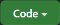
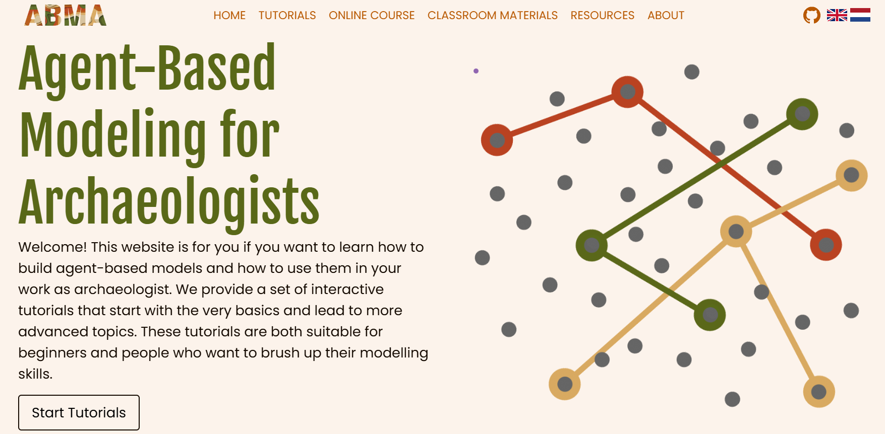

# Introduction to NetLogo {#dev-netlogo-intro}

## Preparation

To prepare for the next sessions, you need to:

- Download or 'clone' the contents of [this repository](https://github.com/CoDArchLab-ABM/course-guide/) into a local folder. Select  in the top right of the repository page in GitHub, and choose one of the options given.

- Download and install the latest version of NetLogo (only if working on your own computer). Currently, it is NetLogo 7.0.4 (file extension .nlogox), but lab computers may have an older version (file extension .nlogo). You won't run into major compatibility issues if you use NetLogo 7.0.0 or higher. The operating system-specific installation files are found here: https://ccl.northwestern.edu/netlogo/download.shtml

## Excursion to ABMA

Before opening NetLogo on your computer, take advantage of the materials available at the Agent-Based Modelling for Archaeologists (ABMA) portal. These were created as an Erasmus+ project by a group of esteemed colleagues to further education on using simulation and agent-based modelling in archaeology. 

Visit ["Tutorials"](https://abmarchaeologists.github.io/ABMA_website/#/about-tutorial) and then "Open Tutorials". You will access an interactive web application that presents a few basic concepts of simulation and agent-based modelling, and familiarises you with NetLogo's interface. You'll do this in NetLogo Web, but it broadly corresponds to what you will see when you open a local installation on your computer. 

Please perform all four lessons (approx. 30 min).
