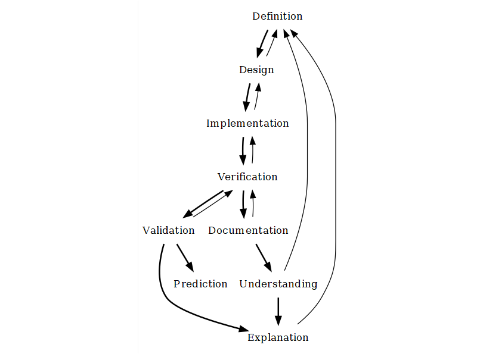

# How to do ABM {#intro-abm-method}

In the remaining sections of the Introduction, we will describe the ABM workflow in more detail. First, we lay out this workflow as practitioners commonly describe it: a sequence of well-ordered steps that can be iterated in a revision cycle. Then, we introduce a few elements 'behind the scenes' that stretch the 'steps' metaphor to its limits. We then review a few practical recommendations that will, hopefully, aid future ABM modellers. These include the verification-refactoring cycle in programming, the use of modular code, and the importance of remaining explorative while designing a model.

## Modelling "steps"

Modelling with ABM can be divided into steps, most of which the practitioner community identifies as normative or recommended phases of model development. With minor variations, other simulation and non-simulation modelling approaches also recognise these steps.

The steps are:

>**Definition of the research question and phenomenon**. To define a research question and the phenomena involved, we must think in terms of systems, identifying and defining a set of relevant elements and their interrelationships. In this initial step, the key is to delimit the target system so that external, undefined factors do not overly determine how the elements interact. Here, we must decide on what is relevant *for us* and set aside the rest. Ideally, we should move to the next step only once we have a hypothetical mechanism to focus on, formulated roughly but detailed enough that we can formalise it later. We will call this our **_conceptual model_**.

>**Design or conceptualisation**. Designing a model is essentially finding a formal definition that represents the phenomena we defined in the previous step. In this step, we go from a vague text description of the *natural* system we observe and its expected dynamics to a mathematical or algorithmic representation of the *artificial* system we want to build. At this stage, it is critical to define our model's main variables, including any inputs and outputs. The latter is particularly important for comparing simulation results with empirical data to validate the model. During model design, we formalise our conceptual model progressively, ideally until implementation becomes immediate. 

>**Implementation**. Implementing the model means effectively writing down our model design as software (*i.e.*, through programming). While other mathematical models can remain unimplemented, ABM models are hardly useful if they cannot be solved through computer simulation. However, a model implementation carries much extra baggage, and many possible implementations exist for the same model. Therefore, modellers and their audience must differentiate between the model and its implementation.

>**Verification**. To verify a model implementation, we run a series of tests on the model code and compare the results with our expectations as model designers. If we wrote a fragment of code to calculate "2 + 2" expecting "4", it should return "4" when run. On the other hand, we can verify a model (not its implementation) only by running an implementation we assume correctly represents the model. If our model states that "2 + 2 = 4", and our implementation returns "4", then we would conclude that the logic behind our model is correct. 

>**Validation**. To validate a model is to iteratively match the conditions of our model (assumptions, parameter values, etc.) to measurable conditions in the targeted system and the results of simulations to equivalent variables measured in the targeted system. ABM modellers often treat validation as an extra, lengthy process, usually separate from the tasks of defining, implementing, and exploring a model. Validation is never absolute: it depends on the amount of data available and the specific criteria chosen. A validated model is not a "correct" model, nor is a model failing validation a "useless" model.

>**Prediction**. A model that is robust in validation might be considered reliable for predicting new evidence. In fact, validation often uses approaches that emulate prediction by reserving a set or type of data to compare with the model output. 

Furthermore, a few authors, myself included, also like to highlight two additional steps that are generally not acknowledged: 

>**Understanding**. The modeller must understand the model, know the range of dynamics it can generate, and be aware of its limitations in representing the target system.

>**Communicating or Documenting**. The understanding modellers gain at one point is of little use to others and, over the long term, to themselves. To ensure this understanding is passed on, we must invest significant time in documenting the model's conceptual design and source code. Note that this is not equivalent to an academic publication, especially because most scientific journals push for a greater emphasis on the results rather than the bits and pieces of simulation models.

## Modelling "(mis)steps"

However, building an ABM model is, in practice, far more complicated than the steps listed above. Many shortcuts exist, such as finding a model or piece of code that can save months of work, but more often obstacles test ABM modellers and the teams of researchers working with them. Some modellers (myself included) have characterised this as a 'reiterative' process, often drawing diagrams showing these steps in well-planned cycles. However, it might be more exact to lose the walking metaphor altogether. 

The first problematic situation that comes to mind is, of course, the "technical issues". Developing ABM models requires a set of skills that are rare and hard to obtain and maintain while doing other research tasks. Probably the most prominent skill of a modeller is programming, which involves conceptual abstraction and a certain agility with the software being used. This becomes even more relevant when the software is poorly documented or requires a particular setup upon installation. This is undoubtedly the first barrier to entry for researchers in the humanities and social sciences. Still, these hardships are usually surmountable with ongoing training, support from more experienced modellers, and the right software. Still, it is undeniably a long-term commitment. 

Unfortunately, ABM issues go deeper than code and software. For example, during the model design process, researchers might need to ask inconvenient and trivial questions about the phenomena represented, which raise a surprising amount of controversy and doubt and can even challenge some of the core assumptions behind a study. In archaeology, this may take the form of aspects considered outside the scope of empirical research because archaeological data are more limited than those in disciplines that focus on contemporary observations (*e.g.*, anthropology, sociology, geography). Should an archaeological ABM model include mechanisms that cannot be validated by archaeological data (at least not in the same sense as experimental sciences)? This is probably the most important unresolved question in this field and possibly the one most responsible for hindering the use of ABM in archaeology.

These complications can be considered problems and opportunities, depending on whether and how they are eventually resolved. In some cases, the difficulty will present a new idea or approach. In contrast, in other cases, dealing with it might cost valuable time and delay the research outcomes beyond any external deadlines (*e.g.*, project funding, dissertation submission). The exercises in this course are presented in the spirit of safeguarding modellers in training from being stopped short by some obstacles while pursuing their research agendas using ABM.

## Best practices

Before jumping into practice, let us review three general strategies that can help with at least some of the problems mentioned here. These strategies are: *version control*, *refactoring regularly*, *enforcing modularity* and *being explorative*.

### Version control

Since modelling an ABM model eventually involves creating software (an implementation), it is important to use version control to track changes and revert to previous versions if necessary. This is especially important when working in a team, but also when working alone. Version control is also useful for tracking changes in the documentation and in the data used for the model. This kind of technology is an essential part of the software development process, and we will dedicate a whole day to it later in the course.

### Refactoring regularly

By definition, [refactoring](https://en.wikipedia.org/wiki/Code_refactoring) means that your code changes but remains capable of producing the same result. Refactoring encompasses all tasks aimed at generalising the code, making it extendable, and making it cleaner (more readable) and faster.

However, these three goals involve a trade-off. For example, replacing default values with calculations or indirect values will probably increase processing time. In practice, this trade-off matters only when your model is very complex, populated (many entities), or must be simulated under many different conditions. I recommend always being attentive to the readability, commentary, and documentation of your code. If you are interested in creating models for academic discussion (i.e., science rather than engineering), prioritise communicating your models to others.

Many actions in code count as refactoring. Too many for us to enumerate here. Probably the best and more educational approach is to encounter examples of practices, both good and bad, think about them, and try to do better. In this sense, we will go over several examples, along with the tutorial, that will hopefully illustrate when and how you should refactor your model code.

### Enforcing modularity

One of the most critical aspects related to refactoring is code modularity. The so-called [Single Responsibility Principle (SRP)](https://en.wikipedia.org/wiki/Single-responsibility_principle) is a core software engineering principle and an excellent guide for building complex code.

In software like ABM models, modularity also has application at a higher level, in the form of submodels. Building models as assemblies of submodels lets researchers focus on their areas of interest and expertise without necessarily over-reducing the complexity of everything else.

ABM has been, and still is, often criticised as too complex and arbitrary in its aims and domain. Truthfully, ABM models tend to overgrow in detail in some areas while bluntly simplifying others. This is primarily a combined effect of the internal limitations of the modellers and their teams (time, budget, expertise, etc.) and the lack of opportunities for code reuse. Modularity offers an exit to this.

Modules can be built as original contributions, implemented from published model specifications, reimplemented from another programming language, or taken and modified as code snippets. We will encounter all these cases later on in this tutorial. 

::: {.callout-note}
#### Where to find modules {.unnumbered}

Modules can come from many sources. The most direct source is, of course, your relevant bibliography. Despite the number of models and modellers, the likely scenario is that the modules you need are still not available as usable implementations. In such cases, you might need to translate model specifications, with a varied level of formalisation, into a working piece of code. The less formal the original contribution, the harder the challenge. Thankfully, a few alternatives let you use modules with little extra coding.

When using NetLogo, we first count on the [NetLogo's Models Library](https://ccl.northwestern.edu/netlogo/models/), a collection of implementation examples classified by discipline and domain. All files are included with the NetLogo installation and are accessible through File > Models Library. If you are interested in taking an evolutionary perspective, it is also worth checking the [OpenEvo NetLogo Models](https://openevo.eva.mpg.de/teachingbase/netlogo/), a collection of models made for learning by the Max Planck Institute for Evolutionary Anthropology.

The wider NetLogo community also hosts two additional libraries, the [NetLogo User Community Models](http://ccl.northwestern.edu/netlogo/models/community/index.cgi) and the [NetLogo Modelling Commons](http://modelingcommons.org/), where modellers from different disciplines can upload models and share and discuss them with others.

Modellers more strongly associated with the SES framework created a similar initiative. Now called [CoMSES Model Library](https://www.comses.net/), formerly openABM, it holds almost as many models as NetLogo Modelling Commons and, although it is cross-platform, most entries are implemented in NetLogo. CoMSES also hosts a curated bibliographic database that helps users search for subject-related models. Although it is extensive, it does not represent all ABM and related modelling being done worldwide. CoMSES relies on voluntary work, as most scientific associations do, and its updates rely on a relatively small community.

More recently, a growing group of researchers involved in ABM in archaeology, including myself, have created an initiative, [Network for Agent-based modelling of Socio-ecological Systems in Archaeology (NASSA)](https://archaeology-abm.github.io/NASSA-hub/), whose principal goal is to create and maintain a public library of modules (*i.e.*, formatted as modules). You are welcome to join our activities and help create this community asset (write me an e-mail!). 

:::

### Being explorative

The last general recommendation to be made about doing ABM is: to be explorative. As mentioned, some have criticised ABM for being too speculative and arbitrary. Yes, ABM models often require many specifications to work, some of which fall outside the modeller's expertise. In light of this, we can either avoid ABM altogether or accept it, going the proverbial extra mile in making most "free decisions" based on a deeper study of possible design alternatives.

As with stochasticity, creating and exploring design alternatives is always a good idea to better understand our conceptual model's weak points. Observing the differences in dynamics generated by those alternatives will help us define those uncertain areas more clearly while reducing the risk of unconsciously overlooking important modelling decisions. In the tutorial, we will illustrate a few strategies for implementing and handling design alternatives.

### Documentation

A short disclaimer before we start: the approach used here for conceptual modelling and model documentation is **not** considered a standard in the ABM community.

In the bibliography, you will find many other recommendations and examples, particularly those converging into the practices closer to Computer Science and Ecology. For example, many consider a necessary standard to be the [Unified Modeling Language (UML)](https://en.wikipedia.org/wiki/Unified_Modeling_Language), which includes many types of diagrams.

 
Derfel73; Pmerson, Public domain, via Wikimedia Commons

 
Use case diagram. Jvlivs, Copyrighted free use, via Wikimedia Commons

The Overview-Design-Details (ODD) protocol is also strongly advocated by ABM practitioners and is continually revisited and updated [@Grimm2006; @Grimm2010; @grimm_odd_2020; @Muller2013].

 
Grimm et al. (2020)

After years of creating and reviewing ABM models, I would argue that these are not as useful or applicable as hoped, especially when the intended audience is largely unfamiliar with simulation modelling and, of course, such standards. In other disciplines, a minimal knowledge of mathematical modelling, including simulation modelling, and programming is a common undergraduate curricular requirement. For those of us pursuing this approach in archaeology and history, with an academic track in the Humanities, the time spent learning documentation standards could be better used to improve programming skills, for example. However, any ABM student should know these proposed standards and judge for themselves. Being informed about them and using them effectively will always put you in a better position as a modeller. I use simple text and generic graphs for this course, while emphasising the importance of maximum clarity in the code.

## Learning resources

Textbook [@romanowska_agent-based_2021]

