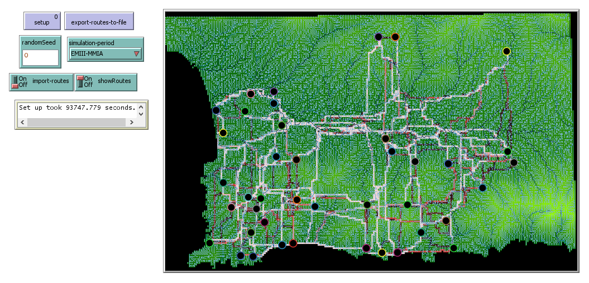
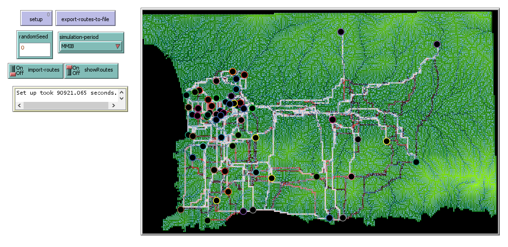

# Scaling up route calculation {#messara-routes}

Before implementing a grounded productivity model in Pond Trade, we must stop and consider the consequences of applying A* to a very different terrain.

First and most obviously, unlike our initial "pond" terrain, the GIS data we are using has no water patches and land patches have different elevation values. We moved from a binary height map (land/water) to a continuous height map that covers only dry land.

## Adapting A* to use a path cost gradient 

We adapt the original implementation of `assign-path-cost` to handle elevation values more precisely. We use a simple approach that sets a patch's path cost to the standard deviation of the elevation of all neighbours and itself. This gives the algorithm a rough sense of terrain roughness, awarding plain sectors the lowest path cost for routes.

```NetLogo
to assign-path-cost

  ask patches with [elevation = noElevationDataTag] [ set pathCost 9999 ] ;;; this makes routes crossing patches with no elevation data extremely unlikely

  ask patchesWithElevationData
  [
    let myValidNeighborsAndI (patch-set self (neighbors with [elevation > noElevationDataTag]))

    ifelse (count myValidNeighborsAndI > 1)
    [
      set pathCost standard-deviation [elevation] of myValidNeighborsAndI
    ]
    [
      set pathCost 1
    ]
  ]

end
```

Another, possibly more rigorous, solution would be to precalculate routes using a least-path-cost analysis in specialised GIS software and import them as a GIS dataset.

## Implementing file export-import procedures: a solution to handle a larger grid

With the large map size and the higher number of settlements, we expect A* route calculations to take significant computation time. For this reason, we are highly motivated to make route calculation the subject of a module that can export the variable `routes` to a file that can be stored and imported later.

As we are already using `export-world` to save our height map with flows, we implement procedures that can manage the export and import of the `routes` variable specifically.

```
to export-routes-to-file

  ;;; build a unique file name to identify current setting
  let filePath (word "data/routes/routes_" simulation-period "_w=" world-width "_h=" world-height "_randomSeed=" randomSeed ".txt")

  file-open filePath

  foreach routes
  [
    aRoute ->

    file-print aRoute
  ]

  file-close

end

to import-routes-from-file

  ;;; get unique file name corresponding to the current setting
  let filePath (word "data/routes/routes_" simulation-period "_w=" world-width "_h=" world-height "_randomSeed=0.txt")

  ifelse (not file-exists? filePath)
  [ print (word "WARNING: could not find '" filePath "'") stop ] ;;; unfortunately the stop command doesn't stop the setup procedure
  [
    file-open filePath

    set routes []

    while [not file-at-end?]
    [
      let lineString file-read-line
      set lineString remove-item 0 lineString
      set lineString remove-item (length lineString - 1) lineString
      set lineString (word "(list " lineString " )")

      set routes lput (run-result lineString) routes
    ]
  ]

  file-close

end
```

## Run and export routes

If you wish to test this step, you may now execute `setup` and `export-routes-to-file` using the sites of each period (`simulation-period`). Because the routes file is already in the repository, you must run a test with `import-routes` switched off. Be aware that the process can take hours. If you started the process and want to stop it, go to "Tools > Halt".

Alternatively, you can run `setup` with `import-routes` switched on and visualise the routes calculated for each pair of sites in each period. This should take around 1-2 minutes.

  
*Screenshot of the 'routes' module displaying routes between EMIII-MMIA sites*

  
*Screenshot of the 'routes' module displaying routes between MMIB sites*

Relying on the tint of routes, we can immediately see that most paths are used by more than one route (bright red), which could be hinting at a relatively stable road structure. A more interesting, but less obvious insight is that 

## Pause for interpretation

Note that the routes calculated with our A* implementation generally agree with Paliou and Bevan's [@paliou_evolving_2016] analysis using other techniques. Routes differ markedly between periods, with minimal overlap during the Prepalatial (EMIII-MMIA) period and the Protopalatial (MMIB) period, marked by much higher centrality in the lower valley where Phaistos is located.

However, remember that this result comes only from combining elevation and site distributions using a least path cost algorithm. A* is a procedural algorithm, which contains explicative elements, but is not a simulation  in the strict sense (i.e. the aim is finding an optimal path, not the representation of a real instance of path walking). We have yet to observe what effects the Pond Trade mechanism has on the economic size of each site, given the routes available in each period. 
