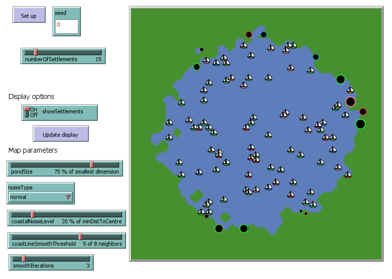
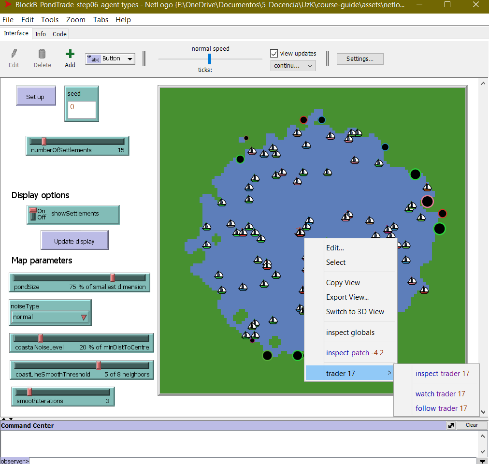
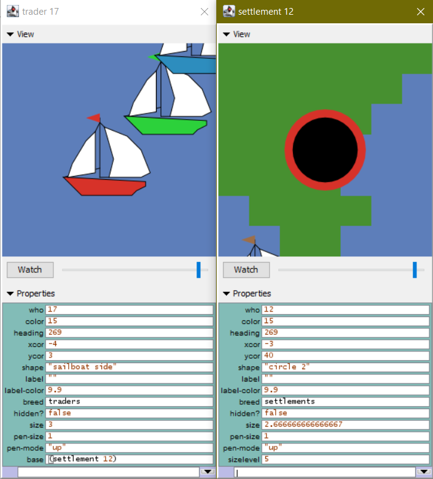

# Defining and initialising agents {#pond-trade-agent-definition}

In the following chapters, we will build a version of Pond Trade through steps that introduce more advanced algorithms that bring us closer to our conceptual model, such as path cost calculation, feedback loops, and evolution through vector variables.

To cover all the steps at a good pace, we will not delve into the same details as in chapter 16. I recommend following the steps in this block and using the copy-and-paste functionality to update your script. If your version at the end of each step doesn't work as expected, compare it to the corresponding script (.nlogo) in the repository (use tools like [Text Compare!](https://text-compare.com/)). If there are any doubts about NetLogo primitives, for example, remember to consult the NetLogo Dictionary from the Help menu. 

Here is a recommended workflow (outside the class):

1. Read the section in the guide  
2. Extend the code in your own file (test procedures separately if needed), preferably doing the coding challenges  
3. Check if your file matches the solution (no need to be identical)  
4. **Repeat**

## Refining the specifications of the conceptual model

Our first aim is to reach a consolidated version corresponding to the first-tier conceptual model. In the original Pond Trade repository, this covers development steps 6 to 9.

  
*Pond Trade conceptual model at start (first tier)*

One necessary first step in implementing an ABM model is to define the types of agents we plan to have, based on our initial conceptual model. We must emphasise the *plan* part here. We may revise the conceptual model to the point that we need more or fewer agent specifications.

## Agent declaration

According to our conceptual model so far, we need two types of agents:

- `settlements`: fixed to a coastal patch and with an "economic size" (`sizeLevel`). Create traders according to their size. 
- `traders`: mobile agents but with a fixed base at a settlement (`base`).

```NetLogo
breed [ settlements settlement ]
breed [ traders trader ]

settlements-own [ sizeLevel ]

traders-own [ base ]
```

::: {.callout-caution}

Notice that we intentionally avoid naming the size of settlements as `size`, since it is a NetLogo primitive used to scale the pixel size of turtles in the view screen.

:::

## Creating `settlements` 🤔

We then write a procedure to create all settlements, which, under the PondTrade specifications, should always be placed in an empty land patch adjacent to at least one water patch (*i.e.*, coastal settlements).

Before looking at the solution, try to write the code yourself:

- Number of `settlements` set by user via a slider (`numberOfSettlements`)  
- Create `settlements` on coastal patches only  
- No more than one `settlement` per patch  
- Assign them a random `sizeLevel` between 1 and 10 (temporary)  
- shape: "circle 2" (arbitrary)  
- size: 1 + `sizeLevel` / 3 (to visualise size differences)  

Work the code like an onion, layer by layer (start with the easier parts):

- How should a `settlement` be initialised? (internal variable settings)  
- How to check if a patch is coastal?  
- How to ensure no more than one `settlement` per patch?  
- How to create a given number of `settlements`?  

**Solution**:

::: {.callout-note collapse="true"}

```NetLogo
to create-coastal-settlements

  ; consider only coastal patches
  let coastalPatches patches with [(isLand = true) and (any? neighbors with [isLand = false])]

  repeat numberOfSettlements
  [
    ; ask a random coastal patch without a settlement already
    ask one-of coastalPatches with [not any? settlements-here]
    [
      sprout-settlements 1 ; creates one "turtle" of breed settlements
      [
        set sizeLevel 1 + random 10; sets a random arbitrary size level for the settlement (between 1 and 10)

        ; give meaningful display proportional to size
        set shape "circle 2"
        set size 1 + sizeLevel / 3
      ]
      ; exclude this patch from the pool of coastal patches
      set coastalPatches other coastalPatches
    ]
  ]

end
```

We introduce the parameter `numberOfSettlements`, which we add to the interface tab as a slider (*e.g.*, spanning from 0 to 100 in increments of 1). We randomise `sizeLevel` to get a sense of how we will visualise these agents.

:::

## Creating `traders` 🤔

We implement the procedure for creating `traders`, which calls all settlements to generate several traders proportional to their `sizeLevel`. We give them a nice sailboat shape and place them randomly inside the pond.

Before looking at the solution, try to write the code yourself:

- Number of `traders` set by the `sizeLevel` of each `settlement` (i.e. bigger settlements have more traders)  
- Each `trader` has a fixed `base` settlement  
- colour: same as the `base` settlement  
- shape: "sailboat side" (arbitrary)  
- size: 3 (arbitrary)  
- Initially place each `trader` somewhere in the pond (not on land) (temporary)  

Again, separate and conquer the different parts of the code:

- How should a `trader` be initialised? (internal variable settings)  
- How to assign a random `base` settlement to each `trader`?  
- How to create a given number of `traders`?  

Tip: use `hatch` to create `traders` from each `settlement`. 

**Solution**:

::: {.callout-note collapse="true"}

```NetLogo
to create-traders-per-settlement

  ask settlements
  [
    let thisSettlement self ; to avoid the confusion of nested agent queries
    hatch-traders round sizeLevel ; use the sizeLevel variable as the number of traders based in the settlement
    [
      set base thisSettlement

      ; give meaningful display related to base
      set shape "sailboat side" ; import this shape from the library (Tools > Shape editor > import from library)
      set color [color] of base
      set size 3

      ; place it somewhere in the pond, randomly for now (if not, the command "hatch-breed" will place them in the same patch of the settlement)
      move-to one-of patches with [isLand = false]
    ]
  ]

end
```

:::

## Adapting `setup` (initialisation) 🤔

Add these procedures to `setup`, after `create-map`:

- Bring all together in `setup` (in which order?)  
- Ensure any previous simulation is cleared first (`clear-all`)  
- Fix the random seed (repeatable results)  
- Add an `update-display` at the end to hide or reveal settlements as per user settings (switch in the interface)  
- If not already done, create the necessary interface elements (sliders, switches, etc.)  

**Solution**:

::: {.callout-note collapse="true"}

```NetLogo
to setup

  clear-all

  ; set the random seed so we can reproduce the same experiment
  random-seed seed

  create-map

  create-coastal-settlements

  create-traders-per-settlement

end
```

Press the Set up button and observe the outcome.

Given how the view screen looks so far, we may end up with too many agent icons later. As a precaution, let us enable a simple visualisation option to switch on and off the settlement icons:

```NetLogo
to setup

  clear-all

  ; set the random seed so we can reproduce the same experiment
  random-seed seed

  create-map

  create-coastal-settlements

  create-traders-per-settlement

  update-display

end

to update-display

  ask settlements [ set hidden? not showSettlements ]

end
```

:::

## Checking the milestone File (step 6)

  
*Pond Trade step 6*

## Check agent variable inheritance

Unless specified otherwise, all new turtles created with `create-<BREED>` or `sprout-<BREED>` are assigned a random colour. In this case, settlements were created by specific patches with `sprout-settlements`, and these created traders with `hatch-traders`. Unlike `create` and `sprout`, the `hatch` command assumes that all variables in common between the creator (`turtle`) and the created (`turtle`) are to be inherited.

To check this after initialising your agents, right-click on top of a trader and select "trader \<WHO NUMBER> > inspect trader \<WHO NUMBER>".



You now get a focus pop-up context menu that shows the values of each agent variable. Do the same to check the information about this trader `base`. This time, however, write the `inspect settlement <WHO NUMBER>` directly into the console. 

However, with our current code, there is no margin for inheritance: all variables with shared names between the two breeds (`xcor`, `ycor`, `color`, etc.) were set explicitly during initialisation (overwriting the inherited values). Go back to `create-traders-per-settlement`, comment out the line `set color [color] of base`:

```NetLogo
to create-traders-per-settlement
      ...

      ; give meaningful display related to base
      set shape "sailboat side" ; import this shape from the library (Tools > Shape editor > import from library)
      ;set color [color] of base
      set size 3

      ...

end
```

Run `setup` again. You can now verify that, even without this line, any trader will have the exact same colour as its base settlement. This small line might be useful though, so let us keep it for now.

  
*Pond Trade step 6 - agent detail*
