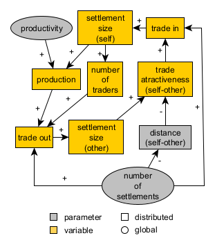
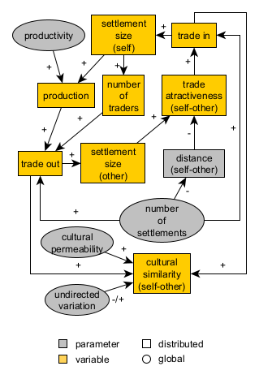

# Conceptual design or modelling: the Pond Trade model {#pond-trade-concept}

## Starting with models as references

To complement the initial "brainstorming" of conceptual models, modellers will often search for and review models already published on related subjects, considering whether they could be reused, at least as inspiration.

Keeping yourself posted about the ABM community may give you an edge. Unfortunately, academic publishing has become saturated, and it is relatively hard to stay up to date on specific research areas, such as ABM models, which are often spread across many kinds of publications. Public model repositories, such as [CoMSES](https://www.comses.net/) and initiatives like the modular library from [NASSA](https://archaeology-abm.github.io/NASSA-hub), may aid you greatly in this task. But, ultimately, finding a relevant model will depend on your skills in Internet search (including prompting the right LLM!) and the attention others have put into preparing and publishing their models.

In the following example, instead of building a model from scratch, we will review the conceptual model for the **_Pond Trade_** model, which I designed in 2018 to facilitate learning ABM, mainly for archaeology and history.

Having started with a mechanism definition (the model), which is already declared to represent a phenomenon relevant to archaeologists (trade), we will then proceed to select a set of evidence types and a case study to demonstrate it.

## The Pond Trade context

The Pond Trade model represents mechanisms that link cultural integration and economic cycles caused by the exchange of materials (“trade”) between settlements placed in a heterogeneous space (“pond”). The Pond Trade design intentionally includes several aspects common to other ABM models in archaeology and the social sciences, such as multiple agent types, the representation of a so-called “cultural vector”, procedural data generation, network dynamics, and the reuse of published submodels and algorithms.

The Pond Trade model and all its versions were developed by me, Andreas Angourakis, and are available for download in [this repository](https://codarchlab-abm.github.io/course-guide/assets/netlogo/) and its [original repository](https://github.com/Andros-Spica/PondTrade).

Graham and Steiner presented a similar model, TravellerSim [-@graham_travellersim_2008], which revisited an older non-ABM model [@rihll_modelling_1991, pp. 59-95], even though the latter was not based on the former. All three, and indeed many more, share the "informal formulation" of the core mechanism, rooted in economic theory, that relates settlement size to interconnectivity. 

::: {.callout-note collapse="true"}

Such a situation, where similar mechanisms are modelled from scratch several times by different researchers, is, in fact, prevalent in the ABM community. A growing number of publications and models circulate across many specialised circles, but they do not always cover all the details of model implementation. Meanwhile, despite CoMSES' efforts and other localised initiatives, there is still no adequate logistical support for orderly sharing and searching for models across disciplines. NASSA's primary mission is to provide a long-term solution to this problem.

:::

## Phenomenon

The Pond Trade model's core idea is inspired by the premise that the settlement economy's size depends on the volume of materials exchanged between settlements for economic reasons (i.e. ‘trade’). The "economic" size of settlements is an overall measure of, for example, population size, the volume of material production, built-up surface, etc. The guiding suggestion was that economy size displays a chaotic behaviour as described in chaos theory: describing apparently "random" oscillations as an emergence of deterministic mechanisms. This chaotic behaviour would presumably stem from shifting trade routes, the outcome of many context-dependent decision-making processes. Furthermore, beyond temporal variation, routes would be bounded by more stable spatial constraints, particularly the contrast between land, maritime, and fluvial routes.

## Mechanism: a first approach

The initial inspiration for a model design may be theoretically profound, empirically grounded, or well connected to discussions in the academic literature. However, a model's core mechanism must narrow to a straightforward, intelligible process. In this case, the focus is to represent a positive feedback loop between settlement size and the trade volumes coming in and out, which can be described as follows:

**Core mechanism**:  
- Traders choose their destination trying to maximise the value of their cargo by considering settlement size and distance from their base settlement;  
- An active trade route will increase the economic size of settlements at both ends  
- An increase in size will increase trade by: 
  - Making a settlement more attractive to traders from other settlements  
  - Allowing the settlement to host more traders.  
- An active trade route will increase the cultural similarity between two settlements through the movement of traders and goods from one settlement to the other (cultural transmission)  

**Elements** (potentially entities):  
- settlements  
- traders  
- terrain  
- routes  
- goods  

**Preliminary rules**:   
- Coastal settlements of variable size around a rounded water body (“pond”)  
- Traders travel between the settlements  
- Traders travel faster or slower depending on the terrain
- Once in their base settlement, traders evaluate all possible trips and choose the one with the greater cost-benefit ratio  
- Traders carry economic value and cultural traits between the base and destination settlements
- Settlement size depends on the economic value received from trading
- The economic value produced in a settlement depends on its size
- The number of traders per settlement depends on its size

**Targeted dynamics**:  
Settlements that become trade hubs will grow in size and exert greater cultural influence over their trade partners, though they also receive much of their aggregated influence.

Or, stated more systematically:

- Settlements grow or shrink depending on the economic value received through trade  
- Trade routes emerge and disappear depending on their usage  
- Cultural traits spread between settlements through traders  

The display above might seem somewhat chaotic and vague, but it represents one of the best-case scenarios for the conciseness of the initial conceptual model. There are no golden rules, good-for-all schemes or "right words" at this stage. Start with your (or your team's) knowledge and hypotheses, then move them into implementation, where you may revise them. In my opinion, don't limit your ideas beforehand to external frameworks (*e.g.*, some of the points required in the ODD).

We use several progressive versions of the Pond Trade conceptual model as examples of how to expand and update the initial design target.  

## Base terrain

The Pond Trade model requires a "geography" of discrete spatial units. For simplicity, we define two spatial unit types: **land** and **water**. The general configuration should form a main water body, the "pond", surrounded by land, with settlements placed around this water body. This gives us the context for differential travel costs between settlements (assuming travel over water is easier/faster) and allows us to work with the concept of *route* in heterogeneous terrain.

## First-tier dynamics

To pace the complexity of the modelling process, we organise the further development of the Pond Trade conceptual model in two tiers. The first tier will aim to cover only some aspects of our initial formulation:

*Mechanisms*:
- ↑ global level of productivity → ↑ settlement production  
- ↑ number of settlements → ↓ distance between settlements
- ↑ settlement size → ↑ settlement production → ↑ trade flow from/to settlement → ↑ settlement size  
- ↑ settlement size → ↑ number of traders based in settlement → ↑ trade flow from/to settlement → ↑ settlement size  
- ↑ trade attractiveness of route A to B → ↑ trade flow A to B  
- ↑ distance A to B → ↓ trade attractiveness A to B
- ↑ size B → ↑trade attractiveness A to B
- ↑ trade flow A to B → ↑ trade flow B to A  

  
*Pond Trade conceptual model at start (first tier)*

Track the paths made by the arrows in our diagram. Notice that we have drawn a system with at least two positive feedback loops (cycles with "+" arrows), one mediated by production and the other by the number of traders.

*Expected dynamics*: differentiation of settlements (size) according to their relative position  

## Second-tier dynamics

To reach the full version of the Pond Trade model, we also need to address the aspects related to cultural transmission and evolution:

*Mechanisms*:  

- ↑ global undirected variation in culture → ↑ or ↓ cultural similarity between A and B (cultural drift)  
- ↑ trade flow A to B → ↑ cultural similarity A and B (cultural integration)  
- ↑ global cultural permeability → ↑ cultural similarity between A and B, if A and B are trading (acceleration of cultural integration)  

  
*Pond Trade conceptual model at start (second tier)*

*Expected dynamics*: cultural integration (clusters) as the outcome of exchange network dynamics  

## Conclusion

Once we define a minimum conceptual model, we should use caution when attempting our first implementation. A relatively simple model may still correspond to code that can be very difficult to control and understand. Simulation models are highly sensitive to feedback loops. You will notice later in the step-wise implementation of the Pond Trade model that the positive feedback loops present in the conceptual model are not included until the most basic and predictable aspects are properly defined and their isolated behaviours verified.
