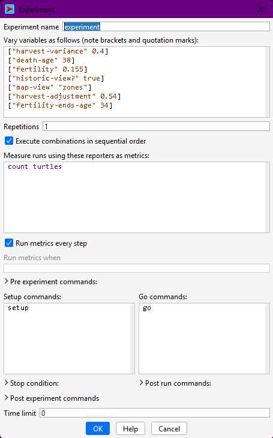

# Using NetLogo's Behaviour Space {#sim-behavior-space}

In this chapter, we will learn the basics of how to set up and run simulation experiments using NetLogo's Behavior Space. We will go from “playing with a model” to doing systematic computational experiments.

First of all, you should know that "experiments" within this context mean a batch of simulations (a.k.a. simulation runs) that contains a certain pattern of variation for parameter configurations or model design alternatives. The main goal of a simulation experiment is the exploration of a part of the model's **parameter space**, that is, to observe the effects of varying parameters (or design aspects regulated as parameters) on the selected output or observation variables.

::: {.callout-note}
**Parameter space**

>the space of all possible parameter values that define a particular mathematical model

>[Wikipedia](https://en.wikipedia.org/wiki/Parameter_space)

Example:

A simple model of health deterioration after developing lung cancer could include the two parameters, sex and smoker/non-smoker, in which case the parameter space is the following set of four possibilities: {(Male, Smoker), (Male, Non-smoker), (Female, Smoker), (Female, Non-smoker)}.

In this case, we would explore each quadrant of the parameter space (i.e., each combination of sex and smoker/non-smoker status) to detect the effects of these two parameters on individual health (dependent variable). We might find, for example, that not being a smoker and being female both positively affect health, yet quantify that not smoking has a greater impact.

We will see more concrete examples of this in the next chapter.
:::

We can technically run such experiments by varying and running each configuration at a time using the model interface, then exporting the variables we want to analyse after each run. However, this task is greatly automatised by Behavior Space. This tool lets us configure multiple simulations with different parameter settings in one place, which we can edit and save to the same model file. Once we place the order, the experiment simulations will be run consecutively in parallel and saved to the same dataset file.

In this chapter, we will see how to proceed for different types of experiments. However, keep in mind NetLogo's own documentation and tutorials on [Behavior Space](https://docs.netlogo.org/7.0.3/behaviorspace).

For simplicity, in this and the following chapters, we will refer to the Artificial Anasazi model included in NetLogo's model library. For reference, a version of this model with a few experiments already created is stored at: [https://github.com/CoDArchLab-ABM/course-guide/blob/main/assets/netlogo/Artificial%20Anasazi_experiments.nlogox](https://github.com/CoDArchLab-ABM/course-guide/blob/main/assets/netlogo/Artificial%20Anasazi_experiments.nlogox)

## Workflow

Before you start, always keep in mind the general workflow when doing simulation experiments with NetLogo's Behavior Space:

```
⚙️ Model setup: NetLogo model ready
        ↓
🎛️ Define experiment: BehaviorSpace parameters & settings
        ↓
▶️ Run experiments: Multiple model runs with varied parameters
        ↓
💾 Export results: CSV output files
        ↓
📊 Analyse results: R scripts for plots & statistics
        ↓
🧩 Interpret results: Compare to hypotheses or data
        ↺
🔁 Refine model or experiment: Adjust parameters, mechanisms
```

## Creating a new experiment

You can access it in the top bar menu at "Tools > BehaviorSpace" or by pressing Ctrl+Shift+B. If you now open it in a fresh version of the model, you should see no experiments. Press "New" and you will see a pop-up window:



From top to bottom, a few points are worth highlighting:

- **Experiment name**: name your experiment according to its pattern of configuration, e.g. "experiment-fertility". Notice that this name will be used in the name of the file.  
- **Variables to vary and how**: In the second text box, you will specify the variables to explore (i.e. parameters) using a specific syntax:  
  - `["variable-name" value]` (fixed value); e.g., `["death-age" 38]`  
  - `["variable-name" value1 value2 value3]` (multiple values); e.g. `["harvest-variance" 0.2 0.4 0.41 0.45 0.5 0.8]`  
  - `["variable-name" minValue step maxValue]` (multiple values with regular steps); e.g. `["harvest-variance" [0.2 0.2 0.8]]`  
- **Repetitions**: number of simulations to be run with each configuration. Use a value greater than one only if your model does not control the random seed; if you do, repetitions will yield the same results.  
- **Reporters**: In the fourth text box, you should specify the names of all the variables or calculations you wish to record in the output dataset, always within the observer scope. Write them on separate lines. By default, NetLogo includes a `count turtles` command as an example, but to keep the link between model code and simulation results, you should always report variables already declared in your code. For this, it is easier and recommended to copy and paste their names from inside the `globals [ ... ]` declaration.  
- **Run metrics every step**: Whether you want NetLogo to print all the reporters every time step (✅) or only at the end of the simulation (⬜).   
- **Pre and post experiment commands, post run commands**: Here you can add small scripts specifying extra procedures to be executed at different moments before and after simulations.  
To see the instructions for each field, with the window selected, move your cursor over the field's title. The instruction text should appear briefly.  
- **Stop condition and Time limit**: If your model does not have a stop condition specified in the code, you may add it here or set an arbitrary number of steps as a limit. Note that it is essential to have a stop condition; if not, your experiment will end only when your machine runs out of memory or not at all!

## Single simulation run

So far, we have run a single simulation each time we execute simulations through a model interface (i.e., every time we run `setup` and `go`). This is very useful for observing certain aspects of the model dynamics, particularly the changes we can directly see in the interface view space and plots.

In the Artificial Anasazi model, a single simulation run corresponds to one possible history of household settlement, farming, movement, and abandonment under a fixed set of assumptions (e.g. fertility, harvest variability, maize productivity).

Running a single configuration in Behavior Space is useful whenever we are outputting values at each time step. This kind of data, a "trajectory", can be analysed for:

* checking that the model behaves plausibly (e.g. households farm, move, and sometimes disappear),
* verifying that the chosen reporters (e.g. population size, number of settlements) are correctly recorded,
* establishing a **baseline scenario** that can later be compared against alternative parameter settings.

To do this, assign fixed values to all parameters in the experiment, and set the number of repetitions to 1. The resulting output mirrors what you would observe from a single manual run, but in a form that is consistent with later experiments and external analysis.

::: {.callout-note}

## Research question example

*Given “typical” values for fertility and harvest variability, does the model produce a broadly stable population, or an eventual decline?*

:::

::: {.callout-tip}

## Exercise

Create a Behavior Space experiment with **no varying parameters** and **1 repetition**.

* Run the experiment once.
* Inspect the output file.
* Identify which reported variables describe *population*, *settlements*, and *time*.

*What does this single run suggest about the overall behaviour of the system?*
:::

## Repetitions under the same parameter configuration

The Artificial Anasazi model includes several stochastic elements, such as variation in harvest success and demographic events. This means that even with identical parameters, two runs may lead to different settlement trajectories or population outcomes.

Running multiple repetitions under the same parameter configuration allows us to:

* quantify the **range of possible outcomes** (e.g. early collapse vs. long-term persistence),
* estimate average trends in population size or settlement count,
* assess whether observed patterns are robust or driven by chance.

In BehaviorSpace, you do this by increasing the *Repetitions* value. Each repetition represents a different random realisation of the same underlying assumptions. In archaeological terms, this can be interpreted as exploring multiple plausible histories consistent with the same environmental and behavioural constraints.

::: {.callout-note}

## Research question example

*Under the same climatic conditions, how variable are population trajectories? Are collapse outcomes rare events or common ones?*
:::

::: {.callout-tip}

## Exercise

Using the same parameter values as before:

* Set the number of repetitions to **at least 10**.
* Run the experiment.
* Plot or inspect the distribution of final population sizes.

*Do all runs behave similarly, or do they diverge substantially?*
:::

---

## Varying parameters

Varying parameters in the Artificial Anasazi model lets us explore how assumptions about the environment and behaviour affect long-term settlement dynamics.

Typical parameters of interest include:

* **harvest-variance**, representing climatic unpredictability,
* **death-age** or fertility-related parameters, affecting demographic turnover,
* productivity or carrying-capacity-related variables.

Behavior Space automatically generates all combinations of parameter values. For example, varying harvest variability across several levels lets us examine how increasing environmental risk affects population stability, mobility, and collapse.

When working with the Anasazi model, parameter variation can be used to:

* test hypotheses about environmental stress,
* explore sensitivity to poorly constrained demographic parameters,
* compare alternative explanations for population decline.

As a rule, parameter exploration ranges should be meaningful, not exhaustive.

::: {.callout-note}

## Research question example

*At what level of harvest variability does the simulated population become unstable or collapse?*
:::

::: {.callout-tip}

## Exercise

Create an experiment where **harvest-variance** takes at least **4 different values**.

* Keep all other parameters fixed.
* Use multiple repetitions per value.
* Compare average population trajectories across values.

*Is there a clear threshold where behaviour changes qualitatively?*
:::

---

## Selecting output variables

In the Artificial Anasazi model, choose output variables that reflect **archaeological observables or theoretical constructs**, rather than internal implementation details.

Commonly reported variables include:

* total population size,
* number of households,
* number of occupied settlements,
* aggregated measures of land use or farming success.

These variables are typically declared as `globals` in the model code and can be directly reported in BehaviorSpace. Reporting such variables makes it easier to link simulation outcomes to archaeological data or interpretive narratives.

You must also decide whether to record outputs:

* **only at the end of each run**, to compare final states (e.g. persistence vs. collapse), or
* **at every time step**, to analyse trajectories such as population growth and decline.

The second option is particularly useful when comparing simulated dynamics to diachronic archaeological records.

::: {.callout-note}

## Research question example

*Do population declines occur gradually or abruptly in the model, and how does this compare to archaeological reconstructions?*
:::

::: {.callout-tip}

## Exercise

Run the same experiment twice:

1. recording outputs **only at the end** of each run;
2. recording outputs **at every time step**.

*What kinds of questions can you answer with the second dataset that are impossible with the first?*
:::

---

## Advanced workflows

### Using special procedures

You can also write custom procedures to be used within experiments in Behavior Space. For example, to define a stop condition that has multiple, more complex criteria or to generate or save specific outputs at specific points in the simulation.

Document these procedures clearly, as they introduce experiment-specific logic into the model.

::: {.callout-note}

## Research question example

*Can we trace which specific runs (rather than average behaviour) produce extreme outcomes such as rapid abandonment?*
:::

::: {.callout-tip}

## Exercise

Inspect the output data of the Artificial Anasazi and identify runs with **extreme outcomes** (e.g. earliest collapse).

* How many such runs are there?
* Do they share the same parameter values?

*What does this tell you about determinism and contingency in the model?*
:::

### Output extra files

Some analyses might require saving outputs in separate CSV files. We have already seen an example of this when exporting the routes calculated in the Messara Trade model. Other times, we might need more detailed outputs than a CSV file can provide—for example, spatial snapshots of settlement locations or land-use patterns.

Using NetLogo’s file output primitives, such as `export-world` or `export-view`, we can easily save complex spatial or distributed data. In the Artificial Anasazi, for example, it is possible to export:

* settlement locations at specific time steps,
* spatial grids of resource availability,
* intermediate states before collapse or abandonment.

When doing so, file names should include the experiment name or parameter values to ensure traceability between files and Behavior Space results. For example:

```NetLogo
let filePath (word "experiments/Artificial Anasazi_" behaviorspace-experiment-name "_randomSeed=" SEED ".txt")

file-open filePath

;;; write data
...


file-close
```

::: {.callout-note}

## Research question example

*Where in the landscape does abandonment begin, and does it spread spatially or occur everywhere at once?*
:::

::: {.callout-tip}

## Exercise

If spatial outputs are available:

* Extract settlement locations from two different runs.
* Compare their spatial patterns at the same simulation time.

*Do similar outcomes arise from similar spatial processes?*
:::

### Running settings from file

For large experimental designs, you can define parameter values for the Artificial Anasazi model externally (e.g., in CSV files) and have the model read them at runtime. This approach supports:

* transparent and reproducible experimental designs,
* integration with statistical tools that generate parameter sets,
* comparison between NetLogo experiments and other modelling approaches.

Although this goes beyond the introductory use of Behavior Space, it reflects common practice in archaeological simulation studies. We will see an example of this in the next chapter.

::: {.callout-note}

## Research question example

*How do results change when parameter combinations are sampled systematically rather than chosen manually?*
:::

::: {.callout-tip}

## Exercise

Design a hypothetical experiment with **many parameters**.

* Which parameters would you prioritise?
* Which would you keep fixed, and why?

*Discuss your choices in terms of archaeological uncertainty and interpretability.*
:::
